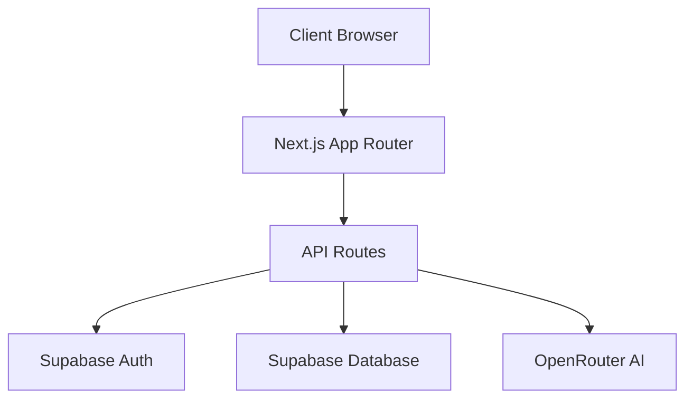
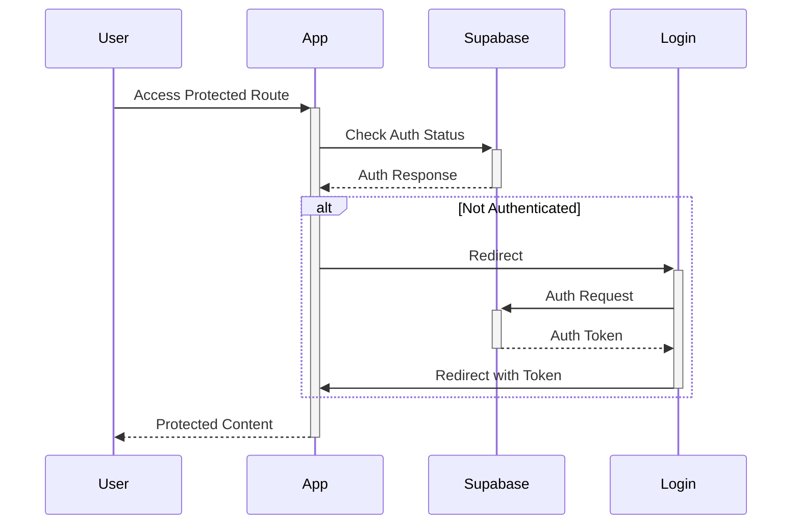

# System Patterns

## Architecture Overview

Novelrunner follows a modern web application architecture using Next.js 14+ with the App Router pattern:



## Core Design Patterns

### 1. Project Structure

```
/src
├── app/          # Next.js App Router pages
├── components/   # Reusable React components
├── lib/          # Utility functions
└── types/        # TypeScript types

/supabase
├── migrations/   # Database migrations
└── seed/         # Seed data
```

### 2. Data Models

#### Novel Project

- Title
- Genre
  - Literary
    - 85000 words
  - Science Fiction
    - 100000 words
  - Fantasy
    - 100000 words
  - Romance
    - 75000 words
  - Mystery
    - 80000 words
  - Thriller
    - 85000 words
  - Young Adult
    - 65000 words
  - New Adult
    - 70000 words
  - Horror
    - 90000 words
  - Novella
    - 30000 words
  - Westerm
    - 65000 words
- Target Word Count
  - Defaults to the genre word count but can be adjusted by the user
- Pace Setting
  - Slow
    - 15000 words per episode
  - Medium
    - 10000 words per episode
  - Fast
    - 7500 words per episode
- Episodes (array)
- Research Notes
- World Building Notes
- Synopsis

#### Episode

- Title
- Target Word Count
- Scenes (array)
- Status
- Current Word Count

#### Scene

- Title
- Content
- Word Count
- Status
- Notes

### 3. Component Patterns

1. **Page Components**

   - Server components by default
   - Client components marked with 'use client'
   - Focused on layout and data fetching

2. **UI Components**

   - Reusable, atomic design
   - Tailwind CSS for styling
   - Responsive design patterns

3. **Data Components**
   - Server-side data fetching
   - Optimistic updates
   - Real-time sync where needed

### 4. State Management

1. **Server State**

   - Supabase for persistent storage
   - Server components for initial data
   - Real-time subscriptions for updates

2. **Client State**
   - React state for UI interactions
   - Form state management
   - Navigation state via App Router

### 5. AI Integration

1. **AI Personas**

   - Modular system for different analysis types
   - Context-aware through project data
   - Focused on analysis not generation

2. **Feedback System**
   - Structured response format
   - Actionable suggestions
   - Integration with editor

### 6. Authentication Flow



## Technical Decisions

1. **Next.js App Router**

   - Server components for performance
   - Built-in routing and layouts
   - API routes for backend logic

2. **Supabase Integration**

   - Authentication and authorization
   - Real-time database capabilities
   - File storage for manuscripts

3. **TypeScript**

   - Type safety across codebase
   - Interface-driven development
   - Enhanced developer experience

4. **Tailwind CSS**
   - Utility-first styling
   - Consistent design system
   - Responsive patterns

## Error Handling

1. **Client-Side**

   - Form validation
   - Error boundaries
   - Toast notifications

2. **Server-Side**
   - API error responses
   - Database error handling
   - AI service fallbacks

## Performance Patterns

1. **Data Loading**

   - Server-side rendering
   - Incremental static regeneration
   - Streaming where appropriate

2. **Optimization**

   - Image optimization
   - Code splitting
   - Cache strategies

3. **Monitoring**
   - Performance metrics
   - Error tracking
   - Usage analytics
